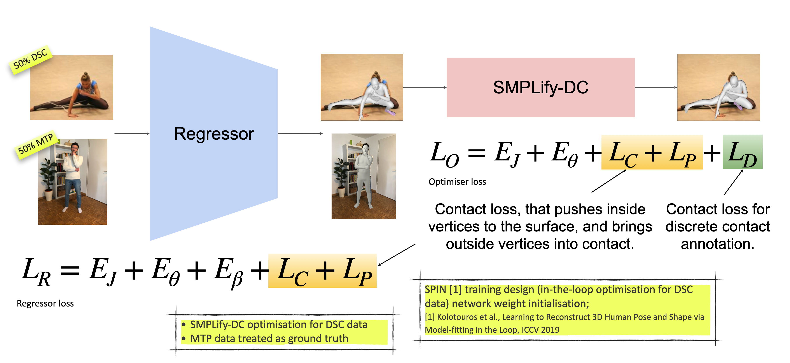
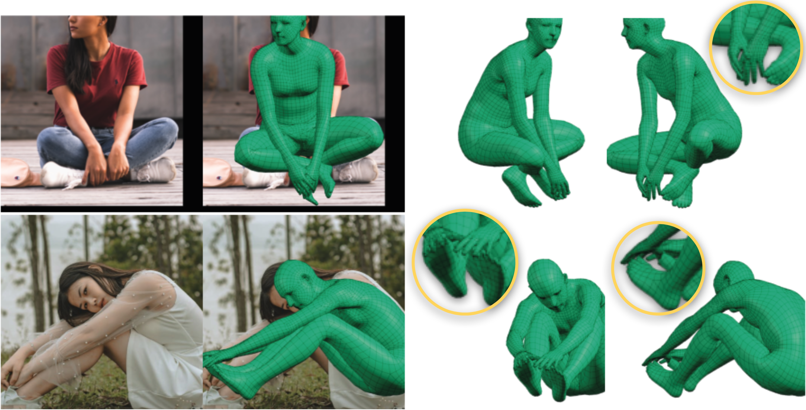

# TUCH
<b>This repo is part of our project: On Self-Contact and Human Pose. </b>\
[[Project Page](https://tuch.is.tue.mpg.de)] [[Paper](https://arxiv.org/pdf/2104.03176.pdf)] [[MPI Project Page](https://www.is.mpg.de/publications/mueller-cvpr-2021)]




## License 

Software Copyright License for **non-commercial scientific research purposes**. Please read carefully the following [terms and conditions](https://github.com/muelea/tuch/blob/master/LICENSE) and 
any accompanying documentation before you download and/or use the TUCH data and software, (the "Data & Software"), including 3D meshes, images, videos, textures, software, scripts, and animations. 
By downloading and/or using the Data & Software (including downloading, cloning, installing, and any other use of the corresponding github repository), you acknowledge that you have read these 
terms and conditions, understand them, and agree to be bound by them. If you do not agree with these terms and conditions, you must not download and/or use the Data & Software. Any infringement 
of the terms of this agreement will automatically terminate your rights under this [License](./LICENSE).


## Description and Demo

TUCH is a network that regresses human pose and shape, while handling self-contact. The network has the same design as [SPIN](https://github.com/nkolot/SPIN), but uses new loss terms, that encourage self-contact and resolve intersections.

 \
TUCH fits for two poses with self-contact.


## Installation

#### 1) Clone this repo
```
git clone git@github.com:muelea/tuch.git
cd tuch
```


#### 32) Create python virtual environment and install requirements

```
mkdir .venv
python3.6 -m venv .venv/tuch
source .venv/tuch/bin/activate
pip install -r requirements.txt --no-cache-dir
```
The torchgeometry package uses (1 - bool tensor) statement, which is not supported. Since we try to invert a mask, 
we can exchange lines 301 - 304 in  `.venv/tuch/lib/python3.6/site-packages/torchgeometry/core/conversions.py`, 
```
FROM: 
    mask_c0 = mask_d2 * mask_d0_d1
    mask_c1 = mask_d2 * (1 - mask_d0_d1)
    mask_c2 = (1 - mask_d2) * mask_d0_nd1
    mask_c3 = (1 - mask_d2) * (1 - mask_d0_nd1)
TO:
    mask_c0 = mask_d2 * mask_d0_d1
    mask_c1 = mask_d2 * (~mask_d0_d1)
    mask_c2 = (~mask_d2) * mask_d0_nd1
    mask_c3 = (~mask_d2) * (~mask_d0_nd1)
```

#### 3) Download the SMPL body model 

Get them SMPL body model from [https://smpl.is.tue.mpg.de](https://smpl.is.tue.mpg.de) and save it under SMPL_DIR.
`ln -s SMPL_DIR data/models/smpl`


#### 4) Download SPIN and TUCH model
Downlaod the SPIN and TUCH model and save it in data/
```
chmod 700 scripts/fetch_data.sh
./scripts/fetch_data.sh
``` 


#### 5) Download essentials (necessary to run training code and smplify-dc demo; not necessary for the tuch demo)

Download essentials from [here](https://download.is.tue.mpg.de/tuch/tuch-essentials.zip) and unpack to METADATA_DIR. Then create symlinks between the essentials and this repo:
```
ln -s $METADATA_DIR/tuch-essentials data/essentials
```

#### 6) Download the MTP and DSC datasets (necessary to run training code and smplify-dc demo; not necessary for the tuch demo)
To run TUCH training, please download:
- Mimic The Pose (MTP) dataset: https://tuch.is.tue.mpg.de
- Discrete self-contact annotations (DSC): https://tuch.is.tue.mpg.de
- Leeds Sports Pose (LSP): https://dbcollection.readthedocs.io/en/latest/datasets/leeds_sports_pose.html#
- Leeds Sports Pose Extended (LSPET): https://dbcollection.readthedocs.io/en/latest/datasets/leeds_sports_pose_extended.html
- Deep Fahsion (DF): http://mmlab.ie.cuhk.edu.hk/projects/DeepFashion.html

For more information on how to prepare the data [read me](https://github.com/muelea/tuch/blob/master/tuch/datasets/preprocess/README.md). 


### TUCH demo
```
python demo_tuch.py --checkpoint=data/tuch_model_checkpoint.pt  \
--img data/example_input/img_032.jpg --openpose data/example_input/img_032_keypoints.json \
--outdir data/example_output/demo_tuch
```
[This](https://www.pexels.com/de-de/foto/frau-in-der-blauen-und-weissen-jacke-und-in-der-blauen-anzughose-818992/) is the link to the demo image.


### SMPLify-DC demo
You can use the following command to run SMPLify-DC on our DSC data, after pre-processing it. 
See [readme](tuch/datasets/preprocess/README.md) for instructions. The output are the initial SPIN 
estimate (columns 2 and 3) and the SMPLify-DC optimized result (column 4 and 5).

```
python demo_smplify_dc.py --name smplify_dc --log_dir out/demo_smplify_dc --ds_names dsc_df \
--num_smplify_iters 100
```


### TUCH Training 
To select the training data, you can use the `--ds_names` and `--ds_composition` flags. 
ds_names are the short names of each dataset, ds_composition their share per batch.
`--run_smplify` uses DSC annotations when available, otherwise it runs SMPLify-DC without L_D term.
If you memory is not sufficient, you can try changing the batch size via the --batch_size flag.

Run TUCH training code:
```
python train.py --name=tuch --log_dir=out --pretrained_checkpoint=data/spin_model_checkpoint.pt \
  --ds_names dsc mtp --ds_composition 0.5 0.5 \
  --run_smplify --num_smplify_iters=10
```

For a quick sanity check (no optimization and contact losses) you can finetune on MTP data only without pushing and pulling terms. For this, use mtp data only and set contact_loss_weight=0.0, and remove the optimization flag:
```
python train.py --name=tuch_mtp_nolplc --log_dir=out/ --pretrained_checkpoint=data/spin_model_checkpoint.pt \
  --ds_names mtp --ds_composition 1.0 \
  --contact_loss_weight=0.0 
```

To train on different data distributions, pass the dsc dataset names to `--ds_names` and their 
share per batch in the same order to `--ds_composition`. For example, \
`--ds_names dsc mtp --ds_composition 0.5 0.5` uses 50 % dsc and 50% mtp per batch and \
`--ds_names dsc mtp --ds_composition 0.3 0.7` uses 30 % dsc and 70% mtp per batch.  


### TUCH Evaluation
```
python eval.py --checkpoint=data/tuch_model_checkpoint.pt --dataset=mpi-inf-3dhp
python eval.py --checkpoint=data/tuch_model_checkpoint.pt --dataset=3dpw
```


### EFT + Contact Fitting for DSC data
Training with in-the-loop optimization is slow. You can do Exemplar FineTuning (EFT) with Contact. For this, first process the DSC datasets. Then run:
```
python fit_eft.py --name tucheft --dsname dsc_lsp
python fit_eft.py --name tucheft --dsname dsc_lspet
python fit_eft.py --name tucheft --dsname dsc_df
```
Afterwards, you can use the eft datasets similar to the DSC data, just add '_eft' to the dataset name:
`--ds_names dsc_eft mtp --ds_composition 0.5 0.5` uses 50 % dsc eft and 50% mtp per batch.
`--ds_names dsc_lsp_eft mtp --ds_composition 0.5 0.5` uses 50 % dsc lsp eft and 50% mtp per batch.


## Citation
```
@inproceedings{Mueller:CVPR:2021,
  title = {On Self-Contact and Human Pose},
  author = {M{\"u}ller, Lea and Osman, Ahmed A. A. and Tang, Siyu and Huang, Chun-Hao P. and Black, Michael J.},
  booktitle = {Proceedings IEEE/CVF Conf.~on Computer Vision and Pattern Recogßnition (CVPR)},
  month = jun,
  year = {2021},
  doi = {},
  month_numeric = {6}
}
```


## Acknowledgement 

We thank Nikos Kolotouros and Georgios Pavlakos for publishing the SPIN code: https://github.com/nkolot/SPIN.
This has allowed us to build our code on top of it and continue to use important features, such as the prior or optimization. 
Again, special thanks to Vassilis Choutas for his implementation of the generalized winding numbers and the measurements code.
We also thank our data capture and admin team for their help with the extensive data collection on Mechanical Turk and 
in the Capture Hall. Many thanks to all subjects who contributed to this dataset in the scanner and on the Internet. Thanks to 
all PS members who proofread the script and did not understand it and the reviewers, who helped improving during the rebuttal.
Lea Mueller and Ahmed A. A. Osman thank the International Max Planck Research School for Intelligent Systems (IMPRS-IS) 
for supporting them. We thank the wonderful PS department for their questions and support.


## Contact

For questions, please contact tuch@tue.mpg.de

For commercial licensing (and all related questions for business applications), please contact ps-licensing@tue.mpg.de.